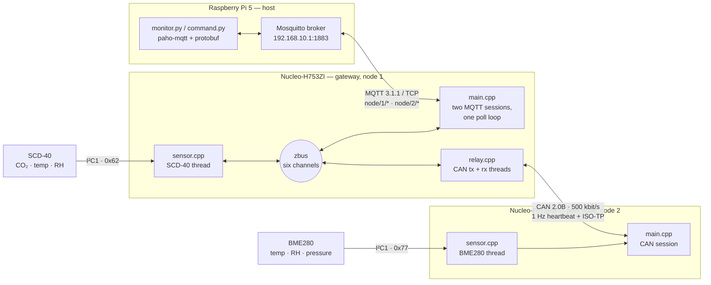

# ClimateNode

**Two Zephyr sensor nodes that publish Protobuf telemetry over MQTT to a host PC — one on Ethernet, one reached over CAN through the first acting as a gateway.**

A practice project rather than a shipping product: two Zephyr C++17 applications and a Python host harness, working end to end on real hardware. One board sits on Ethernet and holds the connection to an MQTT broker. The other has no network of its own and is reached only over a CAN bus, with the first relaying on its behalf. Both read a live sensor over I²C, so the telemetry is measured rather than counted.

## System at a glance



Two paths run through it. **Upward**, a reading crosses I²C into its node's sampling thread, is encoded once into Protobuf, and lands on the broker — the gateway's own on `node/1/…`, the peer's on `node/2/…` after a ride over ISO-TP that the gateway forwards without ever decoding it. **Downward**, a command published on either topic comes back as an `Ack` by the same route reversed. Inside the gateway nothing is point to point: every arrow ends on zbus, which is what lets a single `poll()` wait on two sockets and the whole bus at once.

## What it does

The gateway runs four threads across five translation units that meet only on zbus channels; the peer node adds just its own `main.cpp` and `sensor.cpp` on top of `shared/`. Both are C++17, for the reasons in [`notes/language-cpp.md`](notes/language-cpp.md).

- **Telemetry.** Each node samples on its own thread and publishes a Protobuf `Telemetry` on a sample period that defaults to 5 s. A failed read still publishes, carrying `sensor_status = ERROR` rather than going quiet.
- **Commands.** `SetInterval` (bounded 1 s–300 s), `TriggerMeasurement` and `GetDeviceInfo`, each answered with an `Ack`. A zbus channel validator owns the bounds, so the wire layer cannot drift from them.
- **Reconnect is the shape of the program**, not error handling bolted on: connect → serve until dropped → back off (1 s doubling to 30 s) → retry. Sampling is decoupled from transport, so a backoff never stops the sensor.
- **Liveness** rides a retained `status` topic — `online` on connect, `offline` from the broker's Last Will. The broker cannot see the peer, so the gateway times its heartbeat out and publishes the peer's status itself.
- **The CAN half** carries a 1 Hz heartbeat and ISO-TP segmentation in both directions, on a bus with no addresses, no connection and eight payload bytes per frame.

**The gateway holds two MQTT connections**, `nucleo-1` and `nucleo-2`, for one narrow reason: MQTT 3.1.1 allows one Last Will per connection and the peer's status topic needs its own, so a gateway that dies marks *both* nodes offline through the broker with no firmware in the path.

## The message set

Three messages, defined in **[`proto/node.proto`](proto/node.proto)** — that file is the contract; read it for the fields and the evolution rules.

- **`Telemetry`** (node → host) — the readings, plus a `sequence` for spotting QoS 0 drops, an `uptime_ms`, and a `sensor_status`. The four measurements are proto3 `optional`, so absence is never dressed up as a zero.
- **`Command`** (host → node) — a `oneof` payload: set the interval, trigger a measurement, request device info. nanopb turns it into a tagged union.
- **`Ack`** (node → host) — echoes the command's `sequence` and reports an `AckStatus`; `UNSUPPORTED` and `MALFORMED` are what make the versioning exercise concrete.

All three carry a `schema_version`, bumped only on a *breaking* change. Topics are `node/<id>/{telemetry,command,ack,status}` — telemetry at QoS 0, command/ack at QoS 1, `status` a retained last will carrying ASCII `online`/`offline`. Rationale in [`docs/mqtt-design.md`](docs/mqtt-design.md).

## Hardware

| Role | Board | Sensor on I²C1 (PB8/PB9) | Reaches the broker via |
|---|---|---|---|
| **Gateway**, node 1 | Nucleo-H753ZI — Cortex-M7 | SCD-40 — CO₂, temperature, humidity — `0x62` | on-board RJ45 + LAN8742 PHY |
| **Peer**, node 2 | Nucleo-F072RB — Cortex-M0, **16 KB RAM**, no FPU | BME280 — temperature, humidity, pressure — `0x77` | CAN 2.0B at 500 kbit/s, through the gateway |
| **Host** | Raspberry Pi 5 | — | is the broker: Mosquitto + the Python harness |

Each CAN end needs a 3.3 V SN65HVD230 transceiver and a 120 Ω termination — not optional, because the MCU peripheral exposes only digital TX/RX. Pin assignments and full wiring tables are in [`docs/can-bringup.md`](docs/can-bringup.md) and [`docs/sensor-bringup.md`](docs/sensor-bringup.md).

The Pi is wired **direct-cable** to the Nucleo — static `192.168.10.1` ↔ `192.168.10.2`, no switch and no default gateway, and no application code touching interface bring-up: it is `CONFIG_NET_CONFIG_SETTINGS` in `gateway/prj.conf`. See [`docs/network-bringup.md`](docs/network-bringup.md).

Classic CAN's eight payload bytes per frame and the peer node's RAM budget are the two constraints that make the exercise real: the first forces genuine segmentation, the second means every Kconfig option in `peer-node/prj.conf` has to justify itself in a comment.

## What it is built to teach

With that system in view, here is what the exercise is for. Four topics carry it:

- **MQTT client lifecycle** — connect, keepalive, a QoS per topic, and the reconnect loop above. MQTT frames and delimits its own messages, so there is no app-level framing to write — and the CAN half, which gives none of that, is what shows what MQTT was doing.
- **zbus as the internal bus** — sensing, relaying and publishing decoupled through channels rather than calls. Each channel picks an observer kind: latest-wins where only the newest value matters, every-message where none may be dropped — the same trade-off as QoS 0 versus QoS 1, made a second time inside the firmware.
- **Schema versioning** — field numbers, proto3 `optional`, and what a decoder does with a field it has never heard of. The two sensors measuring different things is what makes `optional` concrete: node 1 reports CO₂ and no pressure, node 2 the reverse, through a gateway that decodes neither. `tests/protocol/` runs the previous schema against the current one in both directions, so old↔new is an assertion rather than a claim.
- **nanopb on a constrained target** — `.options` files, fixed-size versus callback fields, and static allocation only, on a peer node with 16 KB of RAM to hold all of it.

The sensors bring a fifth along for free: the Zephyr sensor subsystem and a devicetree I²C overlay, which is a common shape in production firmware.

None of these is claimed and left there: each is exercised by a lab at the end of the guide that teaches it — numbered exercises with commands, expected output and a **Proves:** line. [`notes/README.md`](notes/README.md) indexes them.

## Running it

**Most of this repo can be read, and its logic exercised, with no hardware at all.** The test suite builds for an emulator and needs nothing plugged in:

```sh
./scripts/test.sh           # 51 Ztest cases on qemu_cortex_m3, ~31 s
```

The five suites cover the wire format, command dispatch and duplicate suppression, the hand-packed CAN heartbeat frame, the relay's liveness state machine, and ISO-TP through an emulated controller — built against the same `shared/` files the boards run.

Building firmware needs the toolchain. The apps are *freestanding*: they build against a shared west workspace at `~/zephyr-workspace` (**Zephyr v4.4.1**), set up in [`docs/toolchain.md`](docs/toolchain.md).

```sh
./scripts/build.sh          # incremental; -p forces pristine (required after devicetree/Kconfig edits)
./scripts/flash.sh          # forces the openocd runner
./scripts/console.sh        # serial console @115200 (quit with Ctrl-A then K)
```

Every wrapper takes `-a <app>` and defaults to `gateway`; the board follows from the app. With both boards attached, `-a` is how anything that must pick one knows which you mean — `flash.sh` stops rather than guessing.

The host side runs **on the Pi**, which is the only machine that can reach the broker, in a venv deliberately separate from the Zephyr workspace's:

```sh
python3 -m venv host/.venv
host/.venv/bin/pip install -r host/requirements.txt
./host/generate.sh                                  # regenerate the bindings after any proto/ change

host/.venv/bin/python host/monitor.py               # decode and log the telemetry stream
host/.venv/bin/python host/command.py info          # also: trigger | interval 2000
```

`monitor.py` subscribes to `node/#` and prints every topic from both nodes in one window:

```
14:02:11  node/1/status        [retained] online
14:02:16  node/1/telemetry     seq=1042  co2=  812 ppm  temp=22.41 C  rh=41.3 %  p=    -- Pa  up=  5210.4s  SENSOR_STATUS_OK  (schema v1)
```

The `--` in the pressure column is the `optional` argument made visible: the gateway has no pressure sensor, so the field is absent rather than zero. [`host/README.md`](host/README.md) is the harness's own guide.

## Where to read next

Documentation is split by *kind*, not by topic. **[`notes/`](notes/README.md)** holds from-first-principles teaching guides — general concepts, largely portable beyond this repo, each ending in a lab you can run against the bench. **[`docs/`](docs/README.md)** holds terse project references — decisions, rationale, and verified facts. Most topics have one of each, cross-linked both ways.

Which index you want depends on what you are doing: `notes/README.md` is the map for *reading* (a suggested order, and what each guide assumes), `docs/README.md` the map for *looking something up* (every guide↔reference pairing). If you are about to *change* something, start instead at [`docs/invariants.md`](docs/invariants.md) — the contracts that span components, every one of which is silent when violated.

The source itself is laid out along the same split:

- **`proto/`** — the schema and nanopb `.options`. The single source of truth for the wire format; firmware and host both generate from it.
- **`shared/`** — what both applications link: the wire format, command semantics, the zbus channels, and the CAN address map both ends must agree on. `tests/` builds against these same files.
- **`gateway/`** / **`peer-node/`** — the two Zephyr apps, each with its own `prj.conf`, `CMakeLists.txt` and board overlay.
- **`host/`** — the paho-mqtt monitor and command client, which run on the Pi.
- **`scripts/`** — the build/flash/console wrappers plus the ST-LINK probe map.
- **`tests/`** — the five Ztest suites, built for `qemu_cortex_m3`.

### Datasheets and upstream docs

- **Adafruit SCD-40 breakout** (the gateway's sensor) — [product page](https://www.adafruit.com/product/5187) and [downloads](https://learn.adafruit.com/adafruit-scd-40-and-scd-41/downloads) (schematic, pinout, wiring; labeled SCD-41, the board is identical).
- **Adafruit BME280 breakout** (the peer node's sensor) — [product page](https://www.adafruit.com/product/2652), the STEMMA QT version. Its `0x77` is a board default, not the chip's only address.
- **Zephyr** — [MQTT client library](https://docs.zephyrproject.org/latest/services/connectivity/networking/api/mqtt.html), [zbus](https://docs.zephyrproject.org/latest/services/zbus/index.html), and the devicetree binding for each sensor: [`sensirion,scd40`](https://docs.zephyrproject.org/latest/build/dts/api/bindings/sensor/sensirion,scd40.html) and [`bosch,bme280`](https://docs.zephyrproject.org/latest/build/dts/api/bindings/sensor/bosch,bme280-i2c.html).
